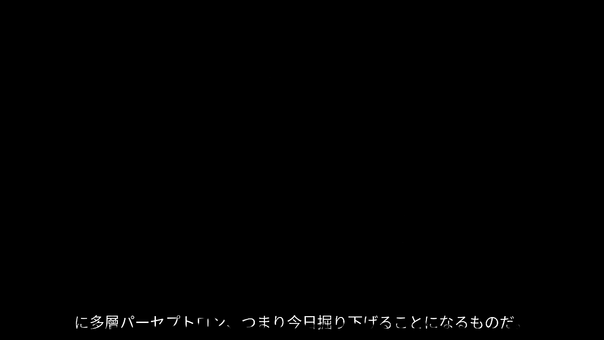

# ADET80k: Subtitle Dataset Generation and High-Quality Segmentation

This repository provides tools for generating a large-scale subtitle segmentation dataset (**ADET80k**) and training models for subtitle segmentation using DeepLabv3+ for coarse masks and Continuous Refinement Model (CRM) for high-quality segmentation.

---

## Repository Structure

```
.
├── examples                       # Example results for quick reference
├── GeneratingSubtitle             # Tools for generating the ADET80k dataset
│   ├── font_cn.ttf                # Font files for subtitles in different languages
│   ├── font_en.ttf
│   ├── font_ja.ttf
│   ├── font_ko.ttf
│   ├── images                     # Input images for dataset generation
│   ├── main.py                    # Main script for dataset generation
│   ├── masks                      # Generated masks (ground truth)
│   ├── my_dataset                 # Final compiled dataset for training
│   ├── text_ch.txt                # Subtitle corpus for Chinese
│   ├── text_en.txt                # Subtitle corpus for English
│   ├── text_ja.txt                # Subtitle corpus for Japanese
│   ├── text_ko.txt                # Subtitle corpus for Korean
│   └── usage.md                   # Detailed usage instructions for this folder
├── High-Quality-Segmentation      # High-quality segmentation pipeline
└── README.md                      # This file
```

---

## Introduction

Accurate text segmentation is essential for text-related generative tasks, including text inpainting, editing, and style transfer. However, current methods often fall short in addressing the complexities of multilingual subtitles, hindered by the lack of a customizable and diverse dataset as well as an efficient pipeline for handling subtitle-specific challenges. In this repository, we introduce **ADET80k**, a customizable synthetic dataset built upon ADE20k, featuring multilingual subtitle text in four languages—English, Chinese, Japanese, and Korean—with diverse typographical effects.

To address subtitle segmentation, we propose a two-stage framework:

1. **DeepLabv3+** generates coarse masks.
2. These masks are subsequently refined using the **Continuous Refinement Model (CRM)** to achieve precise, high-resolution outputs.

---

## Workflow

### 1. Generate the Subtitle Dataset

#### Prepare the Subtitle Corpus
Modify the corpus for each language in:
- `text_en.txt` (English)
- `text_ch.txt` (Chinese)
- `text_ja.txt` (Japanese)
- `text_ko.txt` (Korean)

You can substitute the fonts for subtitles by replacing the font files:
- `font_en.ttf`, `font_cn.ttf`, `font_ja.ttf`, `font_ko.ttf`

#### Set Input Images and Run the Script
Specify the input image folder by modifying the `image_folder` variable in `main.py`.

Run the script to generate the dataset:
```bash
python3 main.py
```

This will generate the dataset into the `generated_dataset` folder:
- `1.jpg`: Image with subtitles
- `1.png`: Ground truth mask for segmentation

---

### 2. Compile the Dataset

Once the dataset is generated, organize it for training and validation:
- Use `./train` for training data and `./validate` for validation data.
- Rename the dataset folder as `my_dataset` and move it to the `High-Quality-Segmentation` folder:
  ```bash
  mv my_dataset ../High-Quality-Segmentation
  ```

---

### 3. Train DeepLabv3+ for Coarse Masks

Navigate to the segmentation folder:
```bash
cd High-Quality-Segmentation/Segmentation
```

Train the DeepLabv3+ model to produce coarse masks:
```bash
python main.py
```

Model checkpoints will be saved in:
```bash
High-Quality-Segmentation/Segmentation/checkpoints
```

---

### 4. Train the Refinement Model

Train the refinement model using the Continuous Refinement Model (CRM):
```bash
python train.py Exp_ID -i 230000 -b 12 --steps 22500 37500 --lr 1.15e-4 --ce_weight 1.0 --l1_weight 0.5 --l2_weight 0.5 --grad_weight 2.0
```

This step refines the coarse masks to achieve high-resolution and precise segmentation.

---

### 5. Perform Inference with Combined Models

Run inference using both models to generate segmentation results:
```bash
python combined_inference.py --dir 3b1b_all_language --model weights/Exp_ID_2024-10-30_03:29:48/model_150000 --output all_language_demo --clear
```

**Options**:
- `--dir`: Path to the input image folder.
- `--model`: Path to the trained model weights.
- `--output`: Folder for storing output results.
- `--clear`: Clears intermediate files after inference.

---

## Example Results

Below are examples of generated subtitles and their corresponding refined masks:

### Dataset Examples

#### Original Subtitles

1. **English Subtitle**:
   

2. **Chinese Subtitle**:
   

3. **Japanese Subtitle**:
   

4. **Korean Subtitle**:
   

#### YouTube Evaluation Results

1. **YouTube English Subtitle**:
   
   

2. **YouTube Japanese Subtitle**:
   
   

---

## Requirements

- Python 3.8+
- Dependencies:
  - `Pillow`
  - `torch`
  - `torchvision`
  - Any additional dependencies (install via `requirements.txt` if provided).

---

## Citation
If you use this dataset or pipeline in your research, please cite our work:

```
@article{yourpaper2025,
  title={ADET80k: Multilingual Subtitle Dataset with Coarse-to-Fine Text Segmentation},
  author={Your Name and Collaborators},
  journal={WACV 2025},
  year={2025}
}
```

